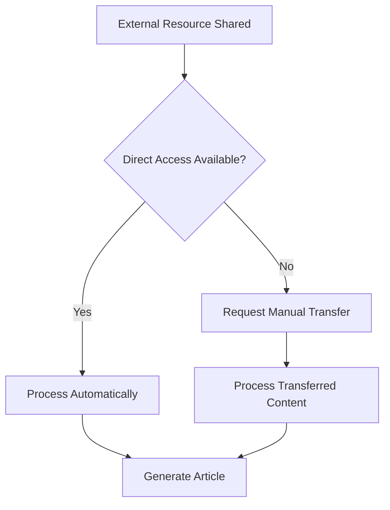

# Accessing and Processing External Resources in Knowledge Management

This exploration emerged from encountering a common but frustrating challenge in modern knowledge work: how to effectively process and extract insights from external resources like shared documents when automated access isn't available. The situation highlights the friction points that often exist between different tools and platforms in collaborative workflows.

## Key Insights

- **Access barriers create workflow interruptions**: Even simple tasks like processing shared documents can become bottlenecks when systems don't integrate seamlessly
- **Manual intervention remains necessary**: Despite advances in automation, human involvement is still required for many knowledge extraction tasks
- **Alternative approaches can maintain momentum**: When direct access fails, pivoting to alternative methods keeps projects moving forward
- **Clear communication about limitations sets proper expectations**: Being transparent about technical constraints helps collaborators understand process boundaries
- **Workflow design should account for common failure points**: Building processes that anticipate access issues leads to more resilient knowledge management systems

## The Challenge: External Resource Access

### The Setup

The situation began with a request to process content from a Google Drive document. This represents a common scenario in collaborative knowledge work - someone shares a resource and expects it to be integrated into a broader knowledge management workflow.

### The Technical Barrier

When attempting to access the shared Google Drive link, I encountered a fundamental limitation: the inability to directly access external documents or browse the web to retrieve content. This created an immediate roadblock in what should have been a straightforward knowledge extraction task.

:::note
This limitation reflects broader challenges in knowledge management systems where different platforms and tools don't always integrate seamlessly, creating friction in collaborative workflows.
:::

### The Response Strategy

Rather than simply stating the limitation and stopping there, the approach involved:

1. **Clear explanation of the constraint**: Acknowledging what wasn't possible and why
2. **Alternative solution offering**: Proposing manual content sharing as a workaround
3. **Process continuation**: Maintaining readiness to complete the task once the barrier was removed

## Exploring Alternative Approaches

### Manual Content Transfer

The most straightforward workaround involves the human collaborator copying and pasting the document content directly into the conversation. While this adds a manual step, it removes the technical access barrier entirely.

**Advantages:**
- Immediate access to content
- Full control over what gets shared
- No dependency on external integrations

**Disadvantages:**
- Additional manual work for the human collaborator
- Potential for incomplete content transfer
- Loss of original formatting and structure

### Workflow Adaptations

This situation highlights the importance of designing knowledge management workflows that account for common access issues:

## Reflection

### What Worked Well

The transparent communication about limitations prevented confusion and set clear expectations. Offering an immediate alternative kept the workflow moving rather than creating a dead end.

### Areas for Improvement

The process revealed the value of having multiple access methods available. In future similar situations, having pre-established protocols for handling external resources could streamline the workaround process.

### Remaining Questions

- How can knowledge management systems better integrate with common external platforms?
- What are the security and privacy implications of different access methods?
- How do we balance automation with maintaining control over sensitive information?

## Related Topics

- **Integration challenges in collaborative tools**: Exploring how different platforms can work together more seamlessly
- **Manual vs. automated knowledge extraction**: Understanding when human intervention adds value versus when it creates inefficiency
- **Designing resilient workflows**: Building processes that gracefully handle common failure points and access limitations