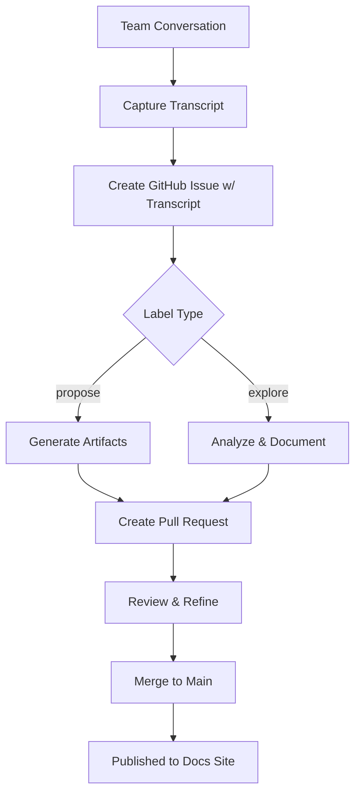

import OpenSpecChanges from '@site/src/components/OpenSpecChanges';

# OpenSpec Changes

These are the changes we're building using the OpenSpec process. Click any artifact to read the proposal, design, or tasks — then check out the result to see what got built.

<OpenSpecChanges />

---

## Start a New Change

Want to propose a new change or explore an idea? Use our project board to create and track OpenSpec issues.

<a href="https://github.com/users/sam-brisson/projects/2" target="_blank" rel="noopener noreferrer" className="button button--primary button--lg" style={{marginBottom: '1rem', display: 'inline-block'}}>
  View Issues on Board →
</a>

Create an issue with a conversation transcript and label it `propose` or `explore` to kick off the process.

### How It Works

**1. Capture the Conversation**

When a team has a meaningful discussion — whether it's a huddle about a new feature, a refinement session exploring edge cases, or a thread debating architectural approaches — the conversation gets captured.

**2. Process with AI**

The captured conversation is submitted as a GitHub issue. Claude analyzes the transcript, identifies key decisions, and generates artifacts based on the label:
- **`propose`** — generates proposal.md, design.md, tasks.md
- **`explore`** — analyzes the conversation and documents insights

Both can create a **new** OpenSpec change or **update an existing one**. Either way, a pull request is created for review.

**3. Review and Refine**

The generated artifacts become a pull request. The team reviews, refines, and merges — just like code. The artifacts evolve through normal collaboration.

**4. Merge and Publish**

Once approved, the PR merges to main. The specs become searchable knowledge on the docs site — documentation that emerged from the work itself.

---

## What Is This?

One of the core ideas we're exploring is whether **systems can document themselves** through the natural flow of team collaboration.

### The Problem with Documentation

Traditional documentation has a fundamental tension:

- **It's written after the fact** — by then, context is lost and motivation is fuzzy
- **It's separate from the work** — so it drifts out of sync as code evolves
- **It's nobody's job** — so it becomes everybody's afterthought

What if documentation emerged automatically from the conversations teams already have?

### Our Approach: OpenSpec

OpenSpec is our experiment in self-documenting systems. The idea is simple:

1. **Teams have conversations** — in Slack huddles, refinement sessions, async threads
2. **Those conversations get captured** — via transcripts, recordings, or notes
3. **AI processes the conversation** — extracting decisions, designs, and tasks
4. **Artifacts are generated automatically** — proposal.md, design.md, tasks.md
5. **The system documents itself** — as a byproduct of normal collaboration

### The Artifacts

Every OpenSpec change produces three artifacts:

| Artifact | Purpose |
|----------|---------|
| **Proposal** | The "why" and "what" — problem statement, proposed solution, scope boundaries |
| **Design** | The "how" — technical approach, architecture decisions, tradeoffs |
| **Tasks** | The "when" — implementation breakdown, sequencing, checkpoints |

These artifacts aren't written by hand. They're generated from team conversations and refined through review.

### The Self-Referential Part

Here's what makes this interesting: **the changes in the table above were built using OpenSpec**.

The OpenSpec Workflow Demo started as a conversation about needing a tangible example. The conversation was processed, artifacts were generated, and the demo was built from those specs. Now you can read the artifacts AND see what they produced.

The system is documenting itself.
