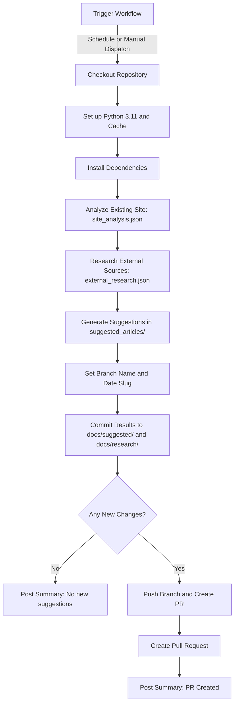

# Article Suggestions Workflow

# 🤖 AI Content Research Agent

This repository includes an automated **AI Content Research Agent** that helps generate article suggestions based on the site’s current content and external research.

## 🔄 Workflow Overview

The agent runs on a **weekly schedule (Mondays at 9AM UTC)**, or it can be triggered manually. It follows these steps:

1. **Checkout Repository** – Pulls the latest code and docs.
2. **Set Up Python Environment** – Installs Python 3.11 and caches dependencies.
3. **Install Dependencies** – Installs required packages from `.github/scripts/requirements.txt`.
4. **Analyze Existing Site Content** – Crawls the site (`SITE_URL`) to extract current topics and structure.
5. **Research External Sources** – Uses external APIs (e.g., Anthropic) to gather fresh insights.
6. **Generate Suggestions** – Creates draft article outlines in `suggested_articles/`.
7. **Prepare Branch & Commit** – Creates a dated branch (e.g., `agent-research-20250830-1707`), moves files into:
   - `docs/suggested/<DATE>/`
   - `docs/research/<DATE>/`
8. **Commit Changes** – If new suggestions exist, commits them.
9. **Create Pull Request (PR)** – Pushes the branch and opens a PR with a summary of suggested articles.
10. **Human Review** – Team members can review, edit, and approve articles before merging.

---

## 📊 Workflow Flow (Text Diagram)

# 🤖 AI Content Research Agent

This repository includes an automated **AI Content Research Agent** that helps generate article suggestions based on the site’s current content and external research.

## 🔄 Workflow Overview

The agent runs on a **weekly schedule (Mondays at 9AM UTC)**, or it can be triggered manually. It follows these steps:

1. **Checkout Repository** – Pulls the latest code and docs.
2. **Set Up Python Environment** – Installs Python 3.11 and caches dependencies.
3. **Install Dependencies** – Installs required packages from `.github/scripts/requirements.txt`.
4. **Analyze Existing Site Content** – Crawls the site (`SITE_URL`) to extract current topics and structure.
5. **Research External Sources** – Uses external APIs (e.g., Anthropic) to gather fresh insights.
6. **Generate Suggestions** – Creates draft article outlines in `suggested_articles/`.
7. **Prepare Branch & Commit** – Creates a dated branch (e.g., `agent-research-20250830-1707`), moves files into:
   - `docs/suggested/<DATE>/`
   - `docs/research/<DATE>/`
8. **Commit Changes** – If new suggestions exist, commits them.
9. **Create Pull Request (PR)** – Pushes the branch and opens a PR with a summary of suggested articles.
10. **Human Review** – Team members can review, edit, and approve articles before merging.

---

## 📝 Review Process

When a PR is created, reviewers should:

1. 📖 Review the suggested article outlines.  
2. 🧪 Consider proposed collaboration experiments.  
3. ✏️ Edit/refine drafts as needed.  
4. 📝 Move approved articles into the main `docs/` directory.  
5. 🔄 Merge when ready.  

---

## ⚙️ Configuration Notes

- **Branch Prefix:** All agent branches start with `agent-research-<DATE>-<TIME>`.  
- **Secrets Required:**
  - `ANTHROPIC_API_KEY` – For external research.  
  - `GH_PAT` – Classic PAT (with `repo` scope) to create PRs.  
- **Workflow File:** `.github/workflows/ai-research-agent.yml`  

---