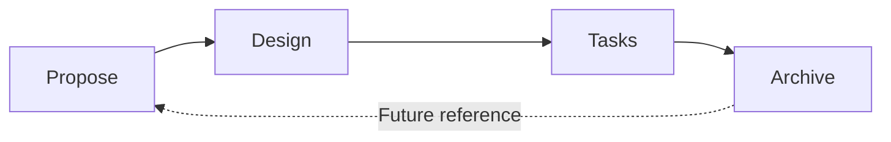
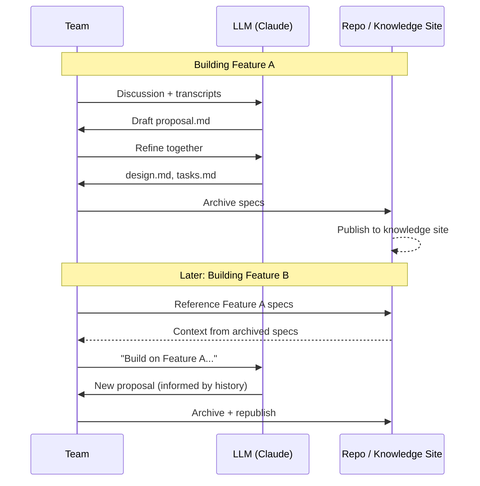

import OpenSpecDemo from '@site/src/components/OpenSpecDemo';

What if the process of building software could also be the process of documenting it? For small product teams moving fast with AI coding assistants, this question isn't academic — it's survival.

## The Knowledge Gap Problem

Small teams using AI assistants like Claude face a paradox. The tools let us move faster than ever, but that speed often comes at the cost of captured knowledge. When an LLM generates code from a chat conversation, the context that shaped those decisions — the tradeoffs considered, the alternatives rejected, the rationale behind the approach — disappears into scroll history.

A week later, when someone asks "why did we build it this way?", the answer is often a shrug. The code exists, but the thinking that produced it has evaporated.

Traditional documentation doesn't solve this. Writing docs after the fact requires reconstructing decisions we've already forgotten. And documentation that lives separately from development inevitably drifts out of sync.

## Spec-Driven Development as Knowledge Capture

[OpenSpec](https://github.com/Fission-AI/OpenSpec) offers a different approach: make the specification artifacts that guide AI implementation *also* serve as the documentation. Instead of chat prompts that disappear, you create structured specs that persist.

The workflow is simple:

*Each stage creates artifacts that both guide AI implementation and document the system.*

When you run `/opsx:propose`, you're not just prompting an AI — you're creating a `proposal.md` that captures the feature's rationale and scope. The `design.md` records architectural decisions. The `tasks.md` tracks implementation progress. When complete, these artifacts get archived, becoming searchable institutional knowledge.

Try clicking through this demo to see what a real PM/Engineer conversation looks like at each stage — and click the artifact links to see the actual spec files:

<OpenSpecDemo />

*This component was itself built using the OpenSpec workflow. Click "View proposal.md" or any artifact link to see the real specs that guided its implementation.*

## The Self-Documenting Loop

Here's the interesting part: when you use a spec-driven approach with an LLM, the AI isn't just reading your specs — it's helping you write them. You describe what you want in natural language, and the LLM generates structured proposals and designs. You refine them together. The spec becomes a collaborative artifact that neither human nor AI produced alone.

This creates what we might call a "self-documenting loop":

*Artifacts flow from development into the knowledge base, then inform future development.*

| Traditional Flow | Spec-Driven Flow |
|-----------------|------------------|
| Chat prompt → Code → (Maybe) Docs | Spec → Design → Code → Archived Spec |
| Context lost in chat history | Context persists in spec files |
| Docs written after (if ever) | Docs emerge from development |
| Knowledge lives in people's heads | Knowledge lives in the repo |

This isn't about generating perfect docs automatically. The specs still need human judgment — deciding what's in scope, evaluating tradeoffs, catching when the AI misunderstands requirements. But the structure ensures that those decisions get captured rather than lost.

## Open Questions

We're early in exploring this pattern, and several questions remain:

- **How much structure is enough?** OpenSpec is deliberately lightweight, but even minimal overhead can slow teams down. Where's the sweet spot?
- **Do archived specs stay useful?** Or do they become another pile of stale documentation nobody reads?
- **What about tacit knowledge?** Specs capture explicit decisions, but much of what makes teams effective lives in shared context that's hard to write down.

## Try This

If you're working with AI coding assistants and feeling the knowledge gap, consider an experiment:

1. Install [OpenSpec](https://github.com/Fission-AI/OpenSpec) in your project
2. For your next feature, try `/opsx:propose` before writing any code
3. After completion, archive the specs and wait a month
4. Come back and see if the archived specs actually help you understand what you built

The test isn't whether the process feels good in the moment — it's whether the artifacts remain valuable over time. That's the difference between spec-driven development as ceremony and spec-driven development as genuine knowledge capture.

---

**Sources:**
- [OpenSpec on GitHub](https://github.com/Fission-AI/OpenSpec)
